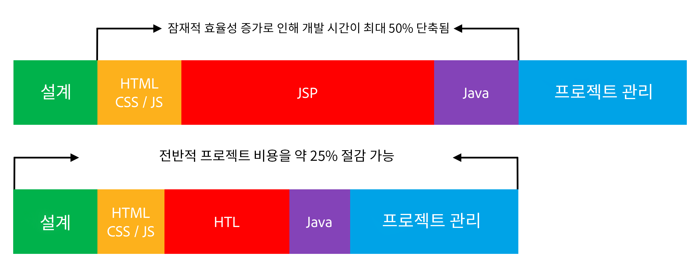

# 개요 {#overview}

Adobe Experience Manager(AEM)에서 지원하는 HTL(HTML 템플릿 언어)은 보안을 강화하는 매우 생산적인 엔터프라이즈 수준 웹 프레임워크를 제공하는 것을 목표로 합니다. 또한 Java 지식이 없는 HTML 개발자의 AEM 프로젝트 참여도를 높일 수 있습니다.

[AEM 6.0에 도입됨](history.md)에서 HTML 템플릿 언어는 AEM에서 HTML을 위한 기본 및 권장 서버측 템플릿 시스템입니다. 강력한 엔터프라이즈 웹 사이트를 구축해야 하는 웹 개발자의 경우 HTML 템플릿 언어가 강화된 보안 및 개발 효율성 달성에 도움이 됩니다.

## 강화되는 보안 {#increased-security}

HTML 템플릿 언어(HTL)는 모든 출력 변수에 컨텍스트 인식 이스케이프를 자동으로 적용하여 사이트 보안을 강화하므로 다른 대부분의 템플릿 시스템보다 훨씬 안전합니다. HTL에서는 HTML 구문을 이해하고 해당 지식을 사용하여 마크업에서의 위치를 기반으로 표현식에 필요한 이스케이프를 조정하므로 이 접근 방식이 가능합니다. 이 메서드로 인해 `href` 또는 `src` 특성에 식을 배치하면 다른 특성이나 다른 곳에 배치된 식에서 다르게 이스케이프될 수 있습니다.

JSP와 같은 템플릿 언어에서도 같은 결과를 얻을 수 있지만 개발자가 각 변수에 적절한 이스케이프가 적용되었는지 수동으로 확인해야 합니다. 적용된 이스케이프에서 하나의 누락 또는 실수로 인해 XSS(크로스 사이트 스크립팅) 취약성이 발생할 가능성이 충분하므로 Adobe은 HTL을 사용하여 이 작업을 자동화하기로 결정했습니다. 필요하면 개발자가 표현식에 서로 다른 이스케이프를 지정할 수도 있지만, HTL에서는 기본 동작이 원하는 동작에 해당할 가능성이 훨씬 많으므로 오류 가능성이 감소합니다.

## 간소화되는 개발 {#simplified-development}

HTML 템플릿 언어는 쉽게 배울 수 있으며 기능은 간단하고 복잡하지 않게 유지되도록 의도적으로 제한했습니다. 또한 마크업을 체계화하고 로직을 호출하는 동시에 마크업과 로직 간 문제의 엄격한 구분을 항상 강제로 적용하는 강력한 메커니즘이 있습니다. HTL은 표현식 및 데이터 속성을 사용하여 동적 동작으로 마크업에 주석을 다는 표준 HTML5입니다. 이 접근 방식은 마크업의 타당성과 가독성을 유지한다. 표현식 및 데이터 속성에 대한 평가가 전적으로 서버측에서 수행되며 클라이언트측에 표시되지 않으므로 원하는 JavaScript 프레임워크를 방해 없이 사용할 수 있습니다.

Java 지식이 없는 HTML 개발자가 이러한 기능을 통해 HTL 템플릿을 편집하고 개발 팀에 통합하며 전체 스택 Java 개발자와의 공동 작업을 간소화할 수 있습니다. 반대로 Java 개발자는 HTML에 대한 걱정 없이 백엔드 코드에 집중할 수 있습니다.

## 절감되는 비용 {#reduced-costs}

보안이 강화되고 개발이 간소화되며 팀 공동 작업이 개선되면 AEM 프로젝트에 드는 노력이 감소하여 TTM(출시 시기)이 빨라지고 TCO(총소유비용)가 절감됩니다.

HTML 템플릿 언어를 사용하여 Adobe.com 사이트를 다시 구현하면 프로젝트 비용과 기간이 약 25%까지 줄어듭니다.

위의 다이어그램은 HTL를 통해 가능해질 수 있는 다음과 같은 효율성 개선 사항을 보여 줍니다.

* **HTML/CSS/JS:** HTML 개발자가 HTL 템플릿을 직접 편집할 수 있으므로 별도의 구현이 필요 없이 AEM 구성 요소에 프론트엔드 디자인을 직접 구현할 수 있습니다. 이 접근 방식은 전체 스택 Java 개발자의 고통스러운 반복을 줄여줍니다.
* **JSP/HTL:** HTL 자체가 Java 지식이 필요하지 않으며 간단하게 쓸 수 있으므로 HTML 전문 지식을 갖춘 개발자가 템플릿을 편집할 수 있습니다.
* **Java:** HTL에서 제공되는 Use-API를 명확하고 간단하게 사용할 수 있으므로 비즈니스 로직이 있는 인터페이스가 명확해지며 Java 개발에도 전반적으로 도움이 됩니다.

## 비디오 소개 {#video}

[AEM Gems 세션](https://experienceleague.adobe.com/en/docs/events/experience-manager-gems-recordings/gems2014/aem-introduction-to-htl)의 다음 비디오에서는 HTL의 목적에 대한 개요와 구현 예제를 제공합니다.

>[!VIDEO](https://video.tv.adobe.com/v/19504/?quality=9)

이 비디오는 HTL을 [이전 이름인 Sightly](history.md)로 참조합니다.

## 다음 단계 {#next-steps}

이제 HTL의 목표와 장점에 대해 알아보았으므로, 해당 언어를 시작할 수 있습니다. [HTML 템플릿 언어 시작하기](getting-started.md)를 참조하십시오.
